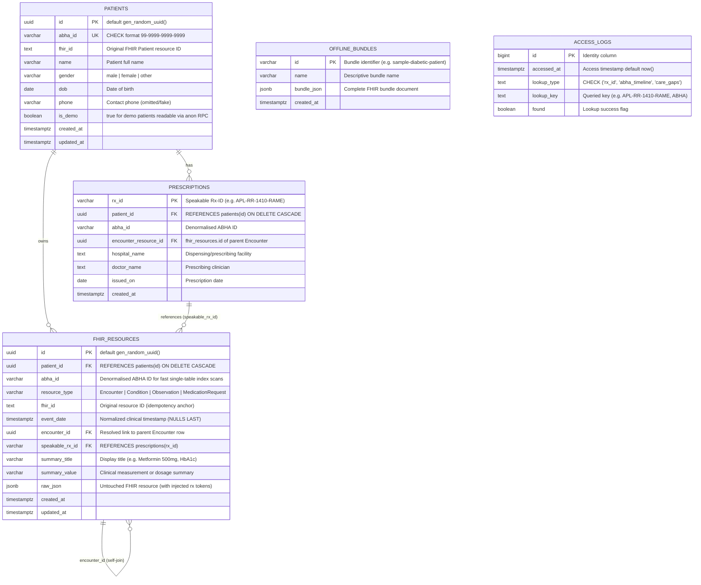

# HealthSafe Data Layer Architecture (Phase 1)

This document provides a comprehensive technical overview of the PostgreSQL / Supabase data layer for **HealthSafe**, an ABDM/NRCeS-styled Personal Health Record (PHR) and Clinician Dashboard.

---

## 1. Overview & Product Context

HealthSafe enables chronic-care patients to own their longitudinal medical history by ingesting HL7 FHIR R4 bundles (specifically adhering to ABDM/NRCeS `OPConsultRecord` style). Key functional requirements supported by this data layer include:

1. **Longitudinal Timeline by ABHA Number**: Fast retrieval and keyset pagination of all clinical events (Encounters, Conditions, Observations, MedicationRequests) for a patient.
2. **Fast Clinician Lookup by Speakable Rx-ID**: A deterministic, human-speakable prescription identifier (e.g., `APL-RR-1410-RAME`) allowing doctors to immediately retrieve the full prescription, its constituent medications, the parent encounter, and minimal non-sensitive patient demographics.
3. **Clinical Care Gap Detection**: Deterministic evaluation of care gaps (such as an overdue HbA1c test for a Type 2 diabetic patient) based on clinical guideline intervals.
4. **Offline Demo Resilience**: Bundles are cached in an `offline_bundles` table and mirrored in the frontend (`public/op-consultation.json`) so the application operates seamlessly during local or offline hackathon pitches.
5. **Strictly Synthetic Data**: All demo records represent synthetic test patients (e.g., Ramesh Kumar, ABHA `91-1234-5678-9012`). No real Protected Health Information (PHI) is ever stored.

---

## 2. Entity-Relationship Diagram (Mermaid ER)



---

## 3. Schema & Indexing Strategy

All database tables are defined strictly via SQL migrations in `supabase/migrations/`:
- `0001_init.sql`: Table definitions, foreign keys, cascade rules, update triggers, and indexes.
- `0002_rls_and_rpc.sql`: Security policies, RPC functions, and permission grants.

### Index Catalog

| Index Name | Table & Target Columns | Purpose & Query Pattern |
|:---|:---|:---|
| `idx_fhir_timeline` | `fhir_resources (abha_id, event_date DESC NULLS LAST)` | Powers the primary patient timeline RPC with instant index scans ordered by event date. |
| `idx_fhir_rx_lookup` | `fhir_resources (speakable_rx_id) WHERE speakable_rx_id IS NOT NULL` | Partial index optimizing the clinician prescription lookup by Rx-ID to fetch all related `MedicationRequest` rows. |
| `idx_fhir_resource_type` | `fhir_resources (resource_type)` | Accelerates filtering by clinical resource category (e.g., Encounter, MedicationRequest). |
| `idx_fhir_patient_type_date` | `fhir_resources (patient_id, resource_type, event_date DESC)` | Accelerates patient-scoped queries for specific clinical domains (e.g. care-gap evaluation). |
| `idx_fhir_encounter_id` | `fhir_resources (encounter_id)` | Optimizes fast self-joins between clinical items and their parent Encounter record. |
| `idx_fhir_raw_json_gin` | `fhir_resources USING GIN (raw_json jsonb_path_ops)` | High-performance compact GIN index enabling arbitrary deep JSON containment queries (`@>`). |
| `idx_prescriptions_patient` | `prescriptions (patient_id)` | Fast lookup of all prescriptions issued for a specific patient. |

---

## 4. Security Model & Row-Level Security (RLS)

> [!IMPORTANT]
> **Demo-Grade Access Control Notice**:
> This phase implements demo-grade access control. Direct table access is completely disabled. Production deployment requires Supabase Auth integration, patient-granted ABDM consent artefacts, short-lived signed tokens, and per-user audit logging.

### Security Principles:
1. **Zero Direct Table Access**: Row-Level Security (RLS) is enabled on all tables (`patients`, `prescriptions`, `fhir_resources`, `offline_bundles`, `access_logs`). No `SELECT`, `INSERT`, `UPDATE`, or `DELETE` policies are granted to `anon` or `authenticated` roles.
2. **Service Role Isolation**: Database writes and ingestion are strictly restricted to the `service_role`. The service-role key is never included in browser bundles or exposed under `VITE_` environment variables.
3. **SECURITY DEFINER RPCs**: Read access is mediated exclusively through security-definer PostgreSQL functions with `SET search_path = public`:
   - `get_prescription_by_rx_id(p_rx_id text)`: Normalizes input (case-insensitive, strips spaces and hyphens) and returns prescription details, all medication requests, parent encounter, and minimal patient demographics (`name`, `gender`, `dob`, `abha_id`). **The patient's phone number is explicitly withheld for privacy.**
   - `get_patient_timeline(p_abha_id text, p_filter_type text, p_limit int, p_before timestamptz)`: Returns timeline items with keyset pagination for demo patients (`is_demo = true`).
   - `get_patient_resources_for_care_gaps(p_abha_id text)`: Returns conditions and observations necessary for clinical rule evaluation.
4. **Audit Trail**: Every access attempt (successful or failed) is automatically logged into the `access_logs` table.

---

## 5. Speakable Rx-ID Specification

The speakable Rx-ID format is `HOS-DD-DDMM-PATI` (e.g. `APL-RR-1410-RAME`):
- **HOS (3 characters)**: Hospital name abbreviation. Generic words (*Hospital, Clinic, Center, Healthcare, Ltd*) are removed. Takes the first remaining word, extracting its first letter plus next two consonants (e.g., *Apollo Hospital* $\rightarrow$ `APL`, *Fortis Healthcare* $\rightarrow$ `FRT`, *Manipal Hospital* $\rightarrow$ `MNP`).
- **DD (2–3 characters)**: Initials of the prescribing doctor after stripping honorifics (*Dr., Prof., Mr., Ms.*) (e.g., *Dr. Rajesh Rao* $\rightarrow$ `RR`).
- **DDMM (4 digits)**: Day and Month extracted via timezone-safe string parsing of the first 10 characters (`YYYY-MM-DD`). *Crucially, it does not use `new Date().getDate()` which shifts across time zones near UTC midnight.*
- **PATI (4 characters)**: First 4 characters of the patient's given name, uppercase (e.g., *Ramesh* $\rightarrow$ `RAME`).

### Encounter-Level Sharing & Collision Allocation:
- Medication requests belonging to the **same encounter/prescription** share the same base Rx-ID (`APL-RR-1410-RAME`).
- If an Rx-ID collides with a **different encounter**, `allocateRxId` automatically appends an alphabetical suffix (`A`, `B`, ...).
- Rx-IDs are injected into the FHIR `MedicationRequest` resources under `RX_TOKEN_SYSTEM = "https://phr-demo.example.org/rx-token"`.

---

## 6. FHIR Parsing & Ingestion Pipeline

Ingestion is executed via `ingestFhirBundle(client, bundle, opts)`:
1. **Zod Validation**: Validates bundle structure (`resourceType === 'Bundle'`, collection/document/transaction type, exactly one Patient).
2. **Defensive Field Mapping**:
   - `Encounter`: `period.start`, summary title from `type` or `class`, summary value from `serviceProvider.display`.
   - `Condition`: `recordedDate` / `onsetDateTime`, summary title from `code.coding.display`, summary value from `clinicalStatus`.
   - `Observation`: `effectiveDateTime` / `issued`, title from `code.coding.display`. For Blood Pressure panels (`LOINC 85354-9`), systolic (`8480-6`) and diastolic (`8462-4`) components are automatically merged into `"148/92 mmHg"`.
   - `MedicationRequest`: `authoredOn`, drug name from `medicationCodeableConcept.text`, dosage instructions from `dosageInstruction[0].text`.
3. **Reference Resolution**: Resolves `urn:uuid:...` and relative `ResourceType/id` references across entries to link encounters to medications, conditions, and observations.
4. **Atomic RPC Execution**: TypeScript maps the resources and calls `ingest_patient_bundle(p_patient, p_resources, p_prescriptions)` in a single transaction. Uses `ON CONFLICT (patient_id, resource_type, fhir_id) DO UPDATE` to ensure total idempotency.

---

## 7. Care Gap Detection Engine

- **Rule**: If a patient has a Condition coded **SNOMED CT 44054006** (Type 2 diabetes mellitus) and either:
  1. The most recent HbA1c test (**LOINC 4548-4**) is older than **180 days** relative to the consultation date (`asOf`), or
  2. No HbA1c test is on record.
- **Output**: Returns an alert object with `{ code: 'HBA1C_OVERDUE', severity: 'high', daysSince, lastValue, lastDate, message }`.
- **Baseline Date (`asOf`)**: Defaults to the patient's latest event date in the data (2024-10-14 for the demo fixture) so historical demo data does not artificially appear centuries overdue when evaluated today.

---

## 8. Setup & Development Guide

### Prerequisites
- Node.js $\ge$ 20
- Supabase CLI (`npm install -g supabase` or local dev dependency via `npx supabase`)
- Docker Desktop (for local PostgreSQL containers)

### Local Development Flow

```bash
# 1. Start local Supabase containers (PostgreSQL, Storage, Auth, Kong API Gateway)
npm run db:start

# 2. Reset database and run all migrations
npm run db:reset

# 3. Seed the synthetic Ramesh Kumar consultation bundle
npm run db:seed

# 4. Generate TypeScript database types
npm run db:types

# 5. Run test suite
npm test

# 6. Run end-to-end integration tests (RLS & RPCs)
npm run test:integration
```

### Linking to a Hosted Supabase Cloud Project

```bash
# 1. Log in to Supabase CLI
npx supabase login

# 2. Link your project with project reference ID
npx supabase link --project-ref <your-project-ref>

# 3. Push schema migrations to the cloud database
npm run db:push

# 4. Seed the cloud database
SUPABASE_URL=https://<your-project-ref>.supabase.co \
SUPABASE_SERVICE_ROLE_KEY=<your-cloud-service-role-key> \
npm run db:seed
```

---

## 9. Assumptions & Decisions Record

| Area | Decision / Assumption | Rationale |
|:---|:---|:---|
| **No Prisma** | Use raw SQL migrations and `@supabase/supabase-js`. | Avoids connection pooler overhead, RLS incompatibilities, and extra runtime dependencies for Supabase. |
| **No Government Namespace** | `RX_TOKEN_SYSTEM` uses `"https://phr-demo.example.org/rx-token"`. | Hackathon demo does not falsely masquerade as an official Indian government endpoint. |
| **Age Calculation** | Patient age is calculated dynamically from `dob`. | Patient age changes over time; storing static age violates healthcare modeling standards. |
| **Privacy Safeguard** | `get_prescription_by_rx_id` explicitly omits patient phone number. | Minimal disclosure principle: clinicians looking up an Rx need name, gender, DOB, and ABHA, but not personal phone numbers. |
| **Demographics for Demo Only** | Public RPCs enforce `WHERE is_demo = true`. | Guarantees that public anon RPCs cannot inadvertently expose non-demo patient records. |
| **Date Timezone Safety** | Parse first 10 characters `YYYY-MM-DD` directly as strings. | JavaScript `new Date("2024-10-14T00:00:00Z").getDate()` in UTC shifts to the 13th in western time zones, corrupting the speakable Rx-ID date code. |
| **Care Gap Baseline** | `asOf` defaults to latest clinical event date in patient records. | Historical 2024 demo data remains clinically accurate without expiring against current calendar time. |

---

## 10. 60-Second Demo Checklist

1. **Verify Database Seeding**:
   - Run `npm run db:seed`.
   - Confirm patient `Ramesh Kumar`, ABHA `91-1234-5678-9012`, and Rx-ID `APL-RR-1410-RAME` are generated.
2. **Clinician Prescription Lookup**:
   - In Clinician Dashboard, type `APL-RR-1410-RAME` (or speakable `APLRR1410RAME`).
   - Confirm instant retrieval of:
     - Header: Apollo Hospital, Dr. Rajesh Rao, 2024-10-14.
     - Medications: Both **Telmisartan 40 mg** and **Metformin 500 mg** are displayed under the same prescription.
     - Demographics: Ramesh Kumar, Male, Age 54 (DOB: 1970-03-12), ABHA `91-1234-5678-9012`. Verify phone number is NOT shown.
3. **Longitudinal Timeline**:
   - Navigate to Patient Timeline with ABHA `91-1234-5678-9012`.
   - Verify reverse-chronological order of consultation, blood pressure (148/92 mmHg), HbA1c (8.1%), and medications.
4. **Care Gap Signal**:
   - Note the prominent badge on the dashboard: **"Care Gap: HbA1c test overdue (187 days)"**.
   - Explain to judges: Clinical guidelines recommend retesting every 90–180 days for type 2 diabetes; HealthSafe automatically detects this from standard LOINC and SNOMED codes.
5. **Security & RLS Proof**:
   - Run `npm run test:integration` (or show integration test results) proving direct `SELECT` on `patients` or `fhir_resources` via the anonymous key returns zero rows, while RPCs strictly return authorized demo data.
